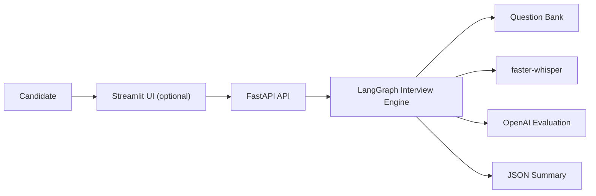
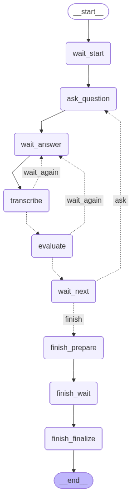

# Smart Interviewer — adaptive AI voice interviews for candidate screening

Smart Interviewer is an AI-powered interviewing system that runs structured voice interviews, evaluates spoken answers in real time, and adjusts difficulty level by level based on candidate performance.

It is designed as a practical foundation for AI screening workflows, technical assessments, and guided interview experiences.

## Demo 🎥

Coming soon: a short demo showing a complete interview flow, live question streaming, spoken candidate answers, adaptive follow-ups, and the final downloadable summary.

## Why This Project 🚀

Many first-round interviews are repetitive, inconsistent, and difficult to scale.

Smart Interviewer shows how AI can support a more structured screening process by combining:

- voice-based interaction
- explicit interview progression rules
- AI grading against reference context
- streamed responses for a smoother experience
- a machine-readable summary at the end

## What It Solves 💡

This project helps teams move beyond static questionnaires and unstructured chatbot demos.

It can be used to:

- run a guided interview without a live interviewer
- standardize how candidates are assessed
- ask follow-up questions when an answer is incomplete
- increase or stop difficulty based on actual performance
- produce a reusable transcript and summary for review

## Who It's For 🧑‍💼

- recruiting and talent teams
- training and certification programs
- bootcamps and technical education providers
- teams building AI assessment or screening products

## What You Can Do ✅

- launch interviews through a FastAPI backend
- use the included Streamlit interface for a working demo UI
- use the included React interface for a Vite-based frontend
- record spoken answers from the browser
- transcribe and evaluate responses automatically
- stream questions and evaluation feedback
- export a JSON summary of the session
- swap the question bank for a different role or knowledge domain

## Key Features ⚙️

- Voice-answer capture with browser audio input
- `faster-whisper` transcription for speech-to-text
- OpenAI-based answer evaluation with structured JSON grading
- Adaptive level progression with configurable pass thresholds
- Follow-up questions for partial or unclear answers
- Streaming interview endpoints using NDJSON
- Downloadable interview summary at the end of the flow
- Markdown-based question bank for easy customization

## Design Highlights 🧠

- **Structured assessment, not free-form chat**  
  The interview runs through explicit phases and allowed client actions.

- **Adaptive difficulty**  
  Candidates progress only when they meet the configured threshold for the current batch of questions.

- **Clarification before failure**  
  The system can ask follow-up questions instead of forcing an immediate pass/fail on weak answers.

- **Easy to retarget**  
  The current sample bank focuses on LLM fundamentals, but the workflow can be adapted by replacing the question bank.

- **Lean MVP architecture**  
  The current implementation runs without an external database, which keeps setup simple for demos, pilots, and custom extensions.

## Architecture at a Glance 🏗️



## Workflow Graph 🔄

The image below is generated from the current interview flow in the codebase.



## Current Sample Content 📚

The repository currently ships with a sample question bank focused on **LLM fundamentals**.

- Levels available: `1` and `2`
- Total sample items: `10`
- Default file: `data/question_bank.md`

This makes the current repo suitable as a demo for technical screening, while still being easy to adapt to other domains.

## Tech Stack 🛠️

- Python 3.11+
- FastAPI
- Streamlit
- React
- Vite
- LangGraph / LangChain
- OpenAI API
- `faster-whisper`
- Docker / Docker Compose

## Quickstart with Docker Compose 🐳

Prerequisites:

- Docker
- Docker Compose
- OpenAI API key

```bash
# 1. Create the Docker env file
cp .env.docker.example .env.docker

# 2. Edit .env.docker and set OPENAI_API_KEY

# 3. Start the API
docker compose up --build

# Optional: start the Streamlit UI too
docker compose --profile streamlit up --build

# Optional: start the React UI too
docker compose --profile react up --build

# Optional: start API + Streamlit + React together
docker compose --profile streamlit --profile react up --build
```

Access services:

- API: `http://localhost:8000`
- API docs: `http://localhost:8000/docs`
- Streamlit UI: `http://localhost:8501` when the `streamlit` profile is enabled
- React UI: `http://localhost:5173` when the `react` profile is enabled

Notes:

- The current Compose setup includes the API plus optional `streamlit` and `react` profiles.
- The image tag referenced by Compose is `aminook/smart-interviewer:0.2.0`.
- Streamlit reads `API_BASE_URL` from the environment. In Compose this should be `http://app:8000`.
- The React container runs the Vite dev server and proxies `/api` to `VITE_API_PROXY_TARGET=http://app:8000`.

## Local Development 💻

Use local processes when you want to work on the app directly.

```bash
cp .env.example .env
# Edit .env and set OPENAI_API_KEY
uv sync --dev
```

If you want to run the React frontend locally, install Node.js 22+ and then install the frontend dependencies:

```bash
cd src/smart_interviewer/frontend/react
npm install
```

### Run the API

```bash
uv run uvicorn smart_interviewer.app:create_app --factory --host 127.0.0.1 --port 8000 --reload
```

### Run the Streamlit UI

```bash
uv run streamlit run src/smart_interviewer/frontend/streamlit_app.py
```

### Run the React UI

```bash
npm run dev -- --host 0.0.0.0 --port 5173
```

Local URLs:

- API: `http://localhost:8000`
- API docs: `http://localhost:8000/docs`
- Streamlit UI: `http://localhost:8501`
- React UI: `http://localhost:5173`

### Run Tests

```bash
uv run pytest
```

## Configuration ⚙️

Key environment variables:

| Variable | Description | Default |
|---|---|---|
| `OPENAI_API_KEY` | OpenAI API key used for interview generation and grading | Required |
| `WHISPER_MODEL_NAME` | Whisper model size | `small` |
| `WHISPER_DEVICE` | Whisper execution device | `cpu` |
| `QUESTIONS_PER_LEVEL` | Questions asked per level | `3` |
| `MIN_PASSED_FOR_LEVEL` | Correct answers required to pass a level | `2` |
| `MAX_FOLLOWUP_QUESTIONS` | Max follow-ups before the system moves on | `2` |
| `QUESTION_BANK_PATH` | Optional custom path for the markdown question bank | `data/question_bank.md` |
| `LLM_MODEL` | OpenAI model used for evaluation | `gpt-4o-mini` |
| `API_BASE_URL` | Base URL the Streamlit UI uses to call the API | `http://localhost:8000` |
| `VITE_API_BASE_URL` | Optional direct base URL the React UI uses to call the API; when unset in dev it uses the Vite `/api` proxy | unset |
| `VITE_API_PROXY_TARGET` | Backend target used by the Vite dev server proxy | `http://127.0.0.1:8000` |
| `AUDIO_SAMPLE_RATE` | Browser recording sample rate | `16000` |

## API at a Glance 🔌

All interview endpoints use the `X-Session-Id` header to track the active session.

Session endpoints:

- `GET /` - health check
- `POST /v1/session/reset` - reset or create a session
- `GET /v1/session/state` - fetch current interview state

Interview endpoints:

- `POST /v1/interview/start`
- `POST /v1/interview/answer`
- `POST /v1/interview/next`
- `POST /v1/interview/finish`

Streaming endpoints:

- `POST /v1/interview/start/stream`
- `POST /v1/interview/answer/stream`
- `POST /v1/interview/next/stream`

Streaming responses use NDJSON so the UI can render tokens progressively.

## Customization 🎯

The easiest way to adapt Smart Interviewer to a new client or use case is to change the question bank.

The current markdown format supports:

- levels
- item IDs
- reference context
- evaluation objectives

You can either:

- edit `data/question_bank.md`, or
- set `QUESTION_BANK_PATH` to a different markdown file

## Roadmap 🗺️

- [ ] Demo video
- [ ] Persistent interview storage
- [ ] Multi-role question packs
- [ ] Branded client-facing UI
- [x] Voice input
- [x] Streaming API responses
- [x] Adaptive interview progression
- [x] Downloadable JSON summary
- [x] Dockerized setup
